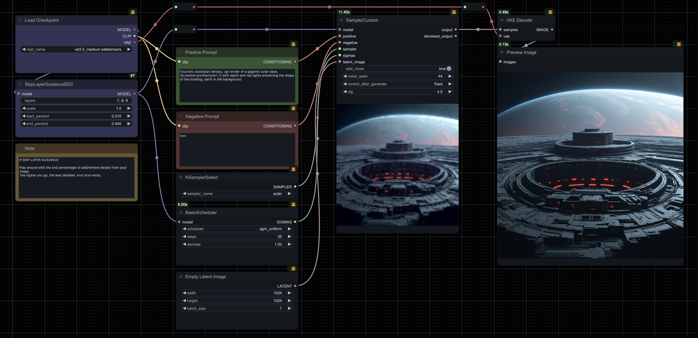

# Stable Diffusion 3.5 Medium workflows for ComfyUI

## How it works

Simply drag the desired `json` file from `./workflows` onto your ComfyUI web interface.

> [!IMPORTANT]
> Most workflows should be using vanilla nodes, however I strongly recommend that you install [ComfyUI-Manager](https://github.com/ltdrdata/ComfyUI-Manager) to install missing nodes